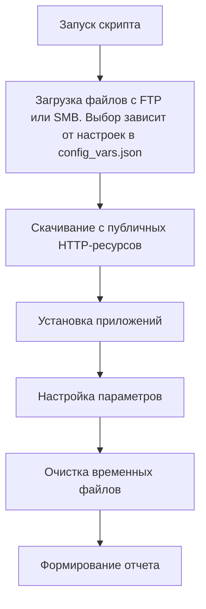
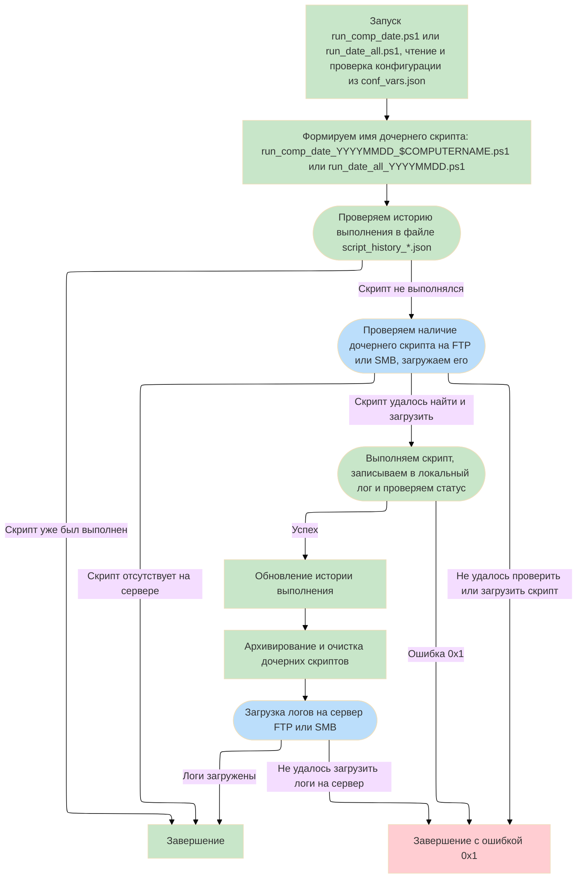
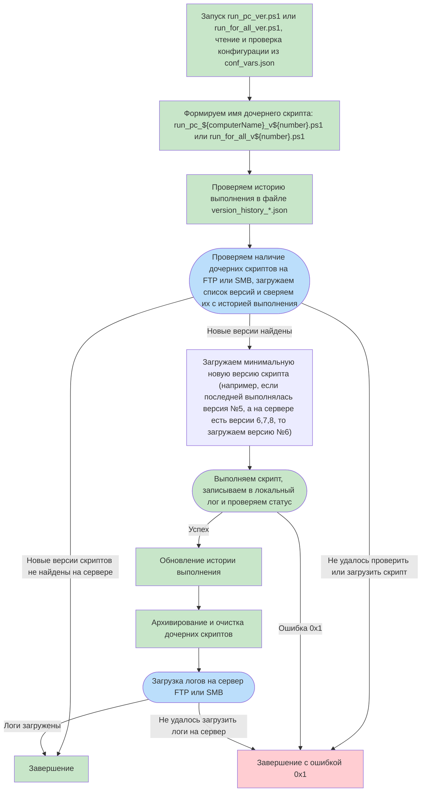

## **Remote Auto 🚀**

Remote Auto - это система централизованного управления выполнением PowerShell-скриптов на удаленных Windows-компьютерах. Она позволяет автоматически загружать и выполнять скрипты по расписанию через FTP/SMB протоколы с полным логированием и безопасным хранением учетных данных.

Изначально система создавалась для автоматизациями управления в средах без домена Active Directory (например, парком ПК с домашними редакциями Windows), но может работать и в домене.

С её помощью можно автоматизировать управление / установку / настройку ПО на рабочих станциях, которые не включены постоянно (например, компьютер включается только 1 раз в неделю на 2 часа).

---

## **🔑 Ключевые компоненты системы**

1. **⚙️ Установщик (**`installer_and_task_creator.ps1`**)**

   -  Создает скрытого локального администратора 👤 для запуска задач

   -  Настраивает права доступа к системным папкам 🔒

   -  Создает 4 задачи в Планировщике заданий Windows 📅:

      -  Ежедневные задачи (по дате) 📆

      -  Версионные задачи (по номерам версий) 🔢

      -  Для всех компьютеров и специфичные для ПК 💻

   -  Генерирует ключи шифрования для паролей 🗝️

2. **📁 Конфигурация (**`config_vars.json`**)**

   -  Центральный файл настроек ⚙️

   -  Определяет протоколы доступа (FTP/SMB) 🌐

   -  Содержит пути к серверам скриптов и логов 🗺️

   -  Настройки учетных записей для сетевых ресурсов 👤

3. **🔐 Генератор учетных данных (**`password_credfile_generator.ps1`**)**

   -  Создает зашифрованные файлы паролей 🔒

   -  Использует AES-256 шифрование 🛡️

   -  Хранит ключи отдельно от зашифрованных данных 🔑

4. **📚 Основные рабочие скрипты, выполняющие роль агентов**

---

### **📚 Типы основных родительских скриптов**

#### **📅 Скрипты по дате**

Выполняют ежедневные задачи на основе текущей даты

1. `run_date_all.ps1` 🌍

   -  Для **всех компьютеров** в сети

   -  Ищет скрипты с именем: `run_date_all_ГГГГММДД.ps1` 🔍

   -  Пример: `run_date_all_20231025.ps1` для 25 октября 2023 📅

   -  Выполняется только 1️⃣ раз в день даже при перезапусках системы

2. `run_comp_date.ps1` 💻

   -  **Специфичен для каждого компьютера**

   -  Ищет скрипты по шаблону: `run_comp_date_ГГГГММДД_ИмяКомпьютера.ps1` 🔎

   -  Пример: `run_comp_date_20231025_WKS001.ps1` 🖥️

   -  Учитывает как дату, так и имя конкретного ПК 🏷️

#### **🔢 Версионные скрипты**

Выполняют обновляемые сценарии по номерам версий. Если нет истории выполнения по версиям, используется v1

1. `run_for_all_ver.ps1` 🌐

   -  Для **всех компьютеров**

   -  Ищет скрипты по шаблону: `run_for_all_vX.ps1` (X - номер версии) 🔍

   -  Пример: `run_for_all_v3.ps1` 🔢

   -  Автоматически находит и выполняет **⬆️ минимальную новую версию**

   -  После выполнения обновляет историю версий 📝

2. `run_pc_ver.ps1` 🖥️

   -  **Специфичен для компьютера**

   -  Ищет скрипты по шаблону: `run_pc_ИмяКомпьютера_vX.ps1` 🔎

   -  Пример: `run_pc_WKS001_v2.ps1` 💻

   -  Выполняет только скрипты, предназначенные для текущего ПК ✅

   -  Поддерживает последовательное выполнение версий ⏭️

---

## **🔄 Типовой рабочий цикл**

1. Администратор размещает новые скрипты на FTP/SMB сервере:

   -  Версионные: `run_for_all_v1.ps1` 🔢

   -  Датированные: `run_date_all_20231025.ps1` 📅

2. На клиентских ПК по расписанию запускаются задачи:

   -  Проверяют наличие новых скриптов 🔍

   -  Сравнивают версии/даты с локальной историей 📊

   -  Загружают новые скрипты при наличии ⬇️

3. Система выполняет скрипт:

   -  Перехватывает вывод в лог-файл 📝

   -  Фиксирует код завершения ✔️/❌

   -  Архивирует исходный скрипт 📦

4. Результаты отправляются на сервер логов:

   -  Через FTP/SMB протокол 🌐

   -  С использованием настроенных учетных данных 🔑

   -  В отдельные папки по датам/компьютерам 🗂️

---

### **💡 Особенности работы**

-  **🔒 Безопасное хранение паролей**

   Пароли могут храниться в открытом виде, но это крайне нежелательно, поэтому используется:

   -  AES-256 шифрование 🔐 для файлов паролей

   -  Раздельное хранение ключей 🗝️ и данных 📁

   -  Ограниченные права доступа к системным папкам 🛡️

-  **🔄 Механизм версионности**

   Система автоматически:

   1. Проверяет доступные версии скриптов на сервере 🔍

   2. Находит минимальную новую версию ⬆️

   3. Загружает и выполняет ее ▶️

   4. Обновляет локальную историю версий 📝

   5. Архивирует и удаляет выполненные скрипты 📦

-  **📝 Логирование и отчетность**

   Каждое выполнение сопровождается:

   -  Детальным логом с системной информанием 📋

   -  Записью результатов выполнения ✔️/❌

   -  Автоматической выгрузкой логов на сервер ☁️

   -  Историей выполненных версий/датированных скриптов 🕒

-  **⏱️ Гибкое расписание**

   По-умолчанию задачи запускаются:

   -  При старте системы (с задержкой) ⏱️

   -  Каждые 2 часа со случайной задержкой ⏳

   -  Триггеры можно настроить в скрипте установщика 🔧

---

## **⚙️ Процедура установки**

1. **📂 Подготовка файлов**

   Скопируйте все файлы проекта в отдельную папку:

   -  installer_and_task_creator.ps1 ⚙️

   -  config_vars.json 📄

   -  password_credfile_generator.ps1 🔐

   -  run\_\*.ps1 (4 исполняемых скрипта) 📜

2. **⚙️ Настройка конфигурации**

   Отредактируйте `config_vars.json`:

   ```json
   {
     "protocolScripts": "ftp",
     "protocolLogs": "smb",
     "protocolFiles": "ftp",
     "smb": {
       "server": "ваш_сервер",
       "shareName": "имя_шары",
       "scriptsFullPath": "путь/к/скриптам",
       "logsFullPath": "путь/к/логам",
       "user": "ваш_пользователь"
     },
     "ftp": {
       "server": "ftp.ваш_сервер",
       "scriptsFullPath": "путь/к/скриптам",
       "logsFullPath": "путь/к/логам",
       "user": "ftp_пользователь"
     }
   }
   ```

3. **🚀 Запуск установки**

   Выполните в PowerShell от имени администратора:

   ```powershell
   # Разрешить выполнение скриптов
   Set-ExecutionPolicy RemoteSigned -Scope Process -Force
   
   # Запустить установщик
   .\installer_and_task_creator.ps1
   ```

4. **👣 Прохождение установки**

   -  Выберите тип учетной записи (системная 🖥️ или новый администратор 👤)

   -  Рекомендуется использовать специальную скрытую учетную запись администратора (по-умолчанию)

   -  При создании администратора введите надежный пароль 🔑

   -  Примите настройки расписания по умолчанию или настройте интервалы ⏰

   -  При необходимости сгенерируйте файлы паролей для FTP/SMB 🔐

---

## **⚙️ Требования к системе**

#### **🔧 Клиентские компьютеры:**

-  **ОС**: Windows 7/8/10/11 или Windows Server 2008 R2+

-  **PowerShell**: версия 5.1 или новее (На Windows 10 и выше работает «из коробки»

-  **Права**: Администраторские права для установки и запуска

-  **Исходящие порты**:

   -  Для SMB: TCP 445

   -  Для FTP: TCP 21 (или кастомный порт из конфига)

-  **Доступ к сетевым ресурсам**: Разрешение на чтение/запись на FTP/SMB серверах


#### **🖥️ Серверная инфраструктура:**

!! Настоятельно рекомендуется использовать только серверы во внутренней сети, в т.ч. доступные через корпоративный VPN-туннель, либо по белым спискам !!

-  **FTP-сервер**:

   -  Настроенные пути:

      -  /scripts - для скриптов выполнения

      -  /logs - для логов

      -  /files - для дополнительных файлов

-  **SMB-сервер**:

   -  Включенная поддержка SMB 2.0 или выше

   -  Настроенные общие папки с путями:

      -  \\scripts

      -  \\logs

      -  \\files

-  **Разрешения**:

   -  Отдельная учетная запись с правами:

      -  Чтение для папки /scripts

      -  Чтение/запись для /logs

      -  Чтение для /files

---

### **📦 Рекомендации по подготовке FTP/SMB сервера**

#### **Для FTP-сервера (на примере FileZilla Server):**

```
1. Создайте виртуальные каталоги:
   [Структура]
   /RemoteAuto
     ├── scripts
     ├── logs
     └── files
        └── _soft

2. Настройте пользователя:
   [Пользователь]
   Логин: remote_auto_user
   Пароль: Super-Duper-Strong-Passw0rd123!
   Права:
     scripts - только чтение
     logs - чтение/запись
     files - чтение
```

Для SMB-сервера принцип аналогичный

---

### **🔒 Рекомендации по безопасности**

1. **Изоляция доступа**:

   -  Используйте отдельную VLAN

   -  Ограничьте доступ к серверам по IP-адресам

   -  Желательно не использовать на сервере другой функционал / роли

2. **Учетные записи**:

   -  Минимальные необходимые привилегии

   -  Регулярная ротация паролей

   -  Блокировка после нескольких неудачных попыток (fail2ban)

3. **Мониторинг**:

   -  Аудит успешных/неудачных попыток доступа

   -  Оповещения о подозрительной активности

   -  Регулярный анализ логов

---

## **💡 Общие рекомендации**

1. **Всегда** тестируйте новые версии дочерних скриптов на контрольных машинах перед массовым развертыванием 🧪

2. Для рабочих сред всегда используйте отдельную учетную запись администратора 👤

3. Не используйте пароли, хранящиеся в открытом виде

4. Регулярно обновляйте пароли через `password_credfile_generator.ps1` 🔄

---

### **✨ Пример дочернего скрипта:** `examples/child_runner_example.ps1`

**Назначение**

Этот скрипт демонстрирует типовой сценарий использования системы Remote Auto - автоматическую установку набора программного обеспечения на удаленных компьютерах.

#### **🔄 Рабочий процесс:**



#### **📦 Устанавливаемые приложения:**

-  7-Zip 🗜️

-  AkelPad ✏️

-  WinDirStat 📊

-  и прочее ПО

#### **💡 Ключевые особенности реализации:**

1. **Гибкая загрузка файлов**:

   -  Поддержка FTP/SMB через центральный конфиг

   -  Автоматическое использование зашифрованных учетных данных

   -  Дополнительное скачивание с HTTP-источников

2. **Надежная установка**:

   -  Тихий режим установки (/S, /verysilent)

   -  Контроль кодов завершения

   -  Обработка требований перезагрузки (код 3010)

3. **Безопасность**:

   -  Очистка временных файлов после установки

   -  Шифрование учетных данных

   -  Централизованное хранение конфигурации

4. **Отчетность**:

   -  Детальный лог каждой операции

   -  Цветовая индикация успеха/ошибки

   -  Глобальный флаг ошибок для родительской системы

#### **⚙️ Технические детали:**

```powershell
# Пример фрагмента установки
try {
    $process = Start-Process "$localFilesDir\AkelPad-4.9.8-x64-setup.exe" `
        -ArgumentList "/S /TYPE=3" `
        -WorkingDirectory $localFilesDir `
        -Wait -PassThru
    
    if ($process.ExitCode -eq 0) {
        Write-Host "[УСПЕХ] AkelPad установлен"
    }
    else {
        Write-Host "[ОШИБКА] Код ошибки: $($process.ExitCode)"
        $globalError = $true
    }
}
catch {
    Write-Host "[ОШИБКА] Ошибка установки: $_"
    $globalError = $true
}
```

#### **📊 Особенности обработки ошибок:**

1. **Индивидуальный контроль** за каждой операцией

2. **Глобальный флаг ошибок** (\$globalError)

3. **Корректное завершение** с exit code 0 даже при ошибках

   -  Чтобы не прерывать цепочку выполнения родительской системы

4. **Детальное логирование** каждой стадии процесса

#### **💡 Как использовать в системе Remote Auto:**

1. Разместите скрипт на FTP/SMB сервере:

   -  Для версионного выполнения: `run_pc_<ИмяПК>_vX.ps1`

   -  Для датированного выполнения: `run_comp_date_<Дата>_<ИмяПК>.ps1`

2. Система автоматически:

   -  Обнаружит новую версию скрипта

   -  Загрузит и выполнит на целевых компьютерах

   -  Отправит логи на центральный сервер

3. Администратор получает:

   -  Централизованные логи установки

   -  Статусы выполнения по каждому ПК

   -  Информацию о требуемых перезагрузках

---

### **🔄 Логика работы родительских скриптов**

#### **📅 Скрипты, выполняемые по дате для всех / дате и компьютеру:**



#### **🔢 Версионные скрипты:**


